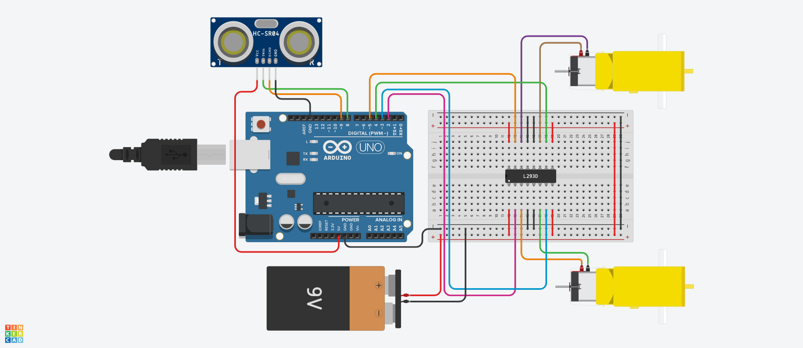

# Carro evasor de obstaculos con L293D 
En esta práctica construiremos un carro evasor de obstáculos utilizando un sensor HC-SR04 y un integrado L293D.

## Materiales
* 1 x Arduino Uno
* 1 x Módulo HC-SR04
* 1 x CI L293D
* 1 x Chasis carro de con motores DC
* Cables Dupont o puentes para protoboard

## Instrucciones
1. Armar el circuito como se muestra en el Layout.
2. Descargar el codigo .ino y abrirlo en el IDE de Arduino.
3. Revisar que el código sea correcto y cargarlo al Arduino.

## Layout

